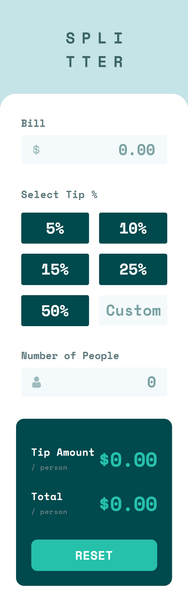
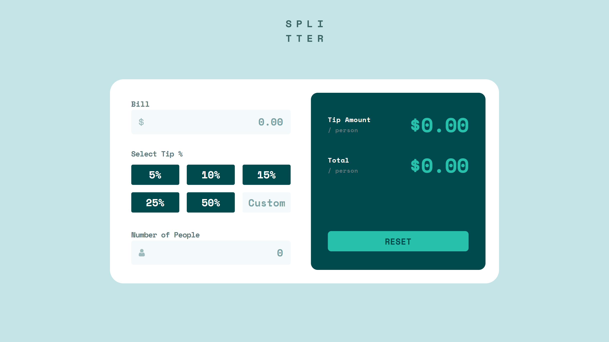

# Frontend Mentor - Tip calculator app

Esta é a minha solução para o desafio [Tip calculator app](https://www.frontendmentor.io/challenges/tip-calculator-app-ugJNGbJUX) do Frontend Mentor.

O objetivo do projeto foi desenvolver uma calculadora de gorjetas responsiva, permitindo que o usuário informe o valor da conta, selecione ou informe uma porcentagem de gorjeta e defina o número de pessoas para calcular o valor da gorjeta e da conta por pessoa.

## Sumário

- [Visão geral](#visão-geral)
  - [Desafio](#desafio)
  - [Screenshot](#screenshot)
  - [Links](#links)
- [Meu processo](#meu-processo)
  - [Tecnologias utilizadas](#tecnologias-utilizadas)
  - [O que aprendi](#o-que-aprendi)
  - [Desenvolvimento contínuo](#desenvolvimento-contínuo)
  - [Recursos úteis](#recursos-úteis)
  - [Colaboração com IA](#colaboração-com-ia)
- [Autora](#autora)
- [Agradecimentos](#agradecimentos)

## Visão geral

### Desafio

Os usuários devem ser capazes de:

- Visualizar o layout ideal da aplicação de acordo com o tamanho da tela;
- Visualizar os estados de hover dos elementos interativos;
- Selecionar uma porcentagem de gorjeta predefinida;
- Informar uma porcentagem personalizada;
- Informar o valor da conta;
- Informar o número de pessoas;
- Receber o valor da gorjeta por pessoa;
- Receber o valor total por pessoa;
- Redefinir todos os valores utilizando o botão de reset.

### Screenshot

#### Mobile


#### Desktop


### Links

- **Desafio no Frontend Mentor:** [Tip calculator app](https://www.frontendmentor.io/challenges/tip-calculator-app-ugJNGbJUX)
- **Live Site:** [Adicionar URL do projeto](https://seu-live-site-aqui.com)

## Meu processo

### Tecnologias utilizadas

- HTML5 semântico
- React
- TypeScript
- Tailwind CSS
- React Hook Form
- Zod
- Vite
- CSS Grid
- Flexbox
- Abordagem mobile-first
- Git e GitHub

### O que aprendi

Este projeto foi desenvolvido como uma forma de praticar React e TypeScript novamente, com foco principalmente no gerenciamento de formulários e validação de dados.

#### Gerenciamento de formulários

Uma das principais partes do projeto foi substituir o gerenciamento manual dos campos por **React Hook Form**.

Durante o desenvolvimento, utilizei `useForm`, `FormProvider`, `useFormContext`, `Controller`, `watch`, `setValue` e `reset`.

Isso me ajudou a entender melhor como centralizar o estado de um formulário e compartilhar suas informações entre componentes sem precisar passar diversos estados e funções por props.

Por exemplo, componentes como `Bill`, `SelectTip` e `PeopleNumber` acessam o mesmo formulário através do `useFormContext`.

#### Validação com Zod

Também utilizei **Zod** em conjunto com `@hookform/resolvers` para definir as regras de validação do formulário.

Um exemplo é a validação do número de pessoas:

```ts
people: z.union([
  z.literal(""),
  z.number().positive("Can't be zero"),
])
```

Isso permite que o campo permaneça vazio inicialmente, mas impede que o usuário tente enviar o formulário com `0` pessoas.

#### Componentização

O formulário foi dividido em componentes menores:

```
Form
├── Bill
├── SelectTip
└── PeopleNumber
```

Essa divisão tornou cada parte do formulário responsável por sua própria área de interação e comportamento, mantendo o componente principal mais organizado.

#### Inputs controlados

Também tive contato mais aprofundado com a diferença entre inputs registrados diretamente pelo React Hook Form e inputs que precisam de `Controller`.

O campo de valor da conta, por exemplo, possui uma formatação específica para moeda, enquanto o campo Custom da gorjeta precisa manter um valor visual diferente do valor efetivamente utilizado no cálculo.

Isso tornou o uso de `Controller` mais apropriado nesses casos.

### Desenvolvimento contínuo

Pretendo continuar praticando:

- Gerenciamento de formulários em React;
- Validação de dados com Zod;
- Tipagem avançada com TypeScript;
- Componentização e organização de aplicações React;
- Acessibilidade em formulários;
- Responsividade e desenvolvimento mobile-first;
- Testes automatizados em aplicações frontend.

Também pretendo continuar utilizando desafios do Frontend Mentor para praticar diferentes padrões de interface e consolidar meu conhecimento em React e TypeScript.

### Recursos úteis
- [React Hook Form](https://react-hook-form.com/) - Documentação utilizada para entender o - gerenciamento de formulários.
- [Zod](https://zod.dev/) - Documentação utilizada para definir os schemas de validação.
- [Tailwind CSS](https://tailwindcss.com/) - Documentação utilizada para estilização e responsividade.
- [Frontend Mentor](https://www.frontendmentor.io/) - Plataforma utilizada para o desafio e para praticar desenvolvimento frontend.

### Colaboração com IA

Utilizei o ChatGPT como ferramenta de apoio durante o desenvolvimento.

A IA foi utilizada principalmente para:

Esclarecer conceitos e APIs do React Hook Form;
Auxiliar na integração entre React Hook Form e Zod;
Investigar e corrigir problemas de tipagem no TypeScript;
Debater diferentes formas de estruturar os componentes do formulário;
Identificar problemas relacionados ao gerenciamento de estado e reset dos campos;
Revisar decisões de implementação e responsividade.

A implementação e as decisões finais foram feitas por mim, utilizando as sugestões como apoio para compreender os problemas e encontrar soluções.

## Autora
Frontend Mentor - [@Isabela-Fernanda](https://www.frontendmentor.io/profile/Isabela-Fernanda)
GitHub - [@Isabela-Fernanda](https://github.com/Isabela-Fernanda)

## Agradecimentos

Agradeço ao [Frontend Mentor](https://www.frontendmentor.io/) pela oportunidade de praticar desenvolvimento frontend através de desafios baseados em interfaces reais.

Também utilizei o ChatGPT como ferramenta de apoio durante o processo de desenvolvimento e aprendizado.